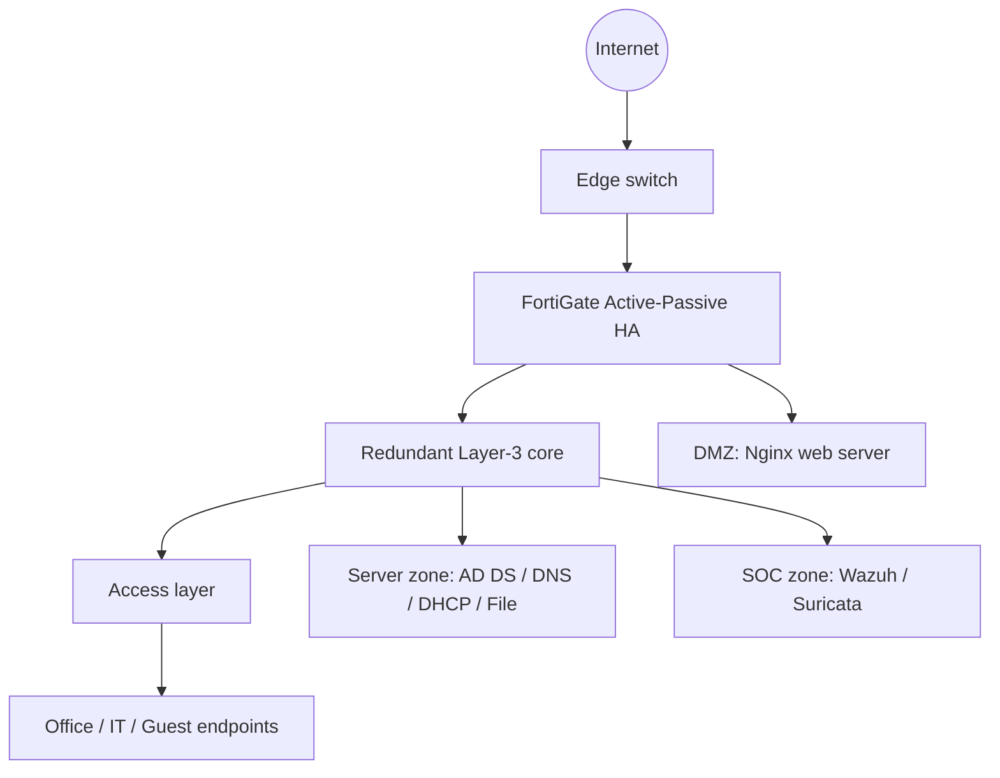
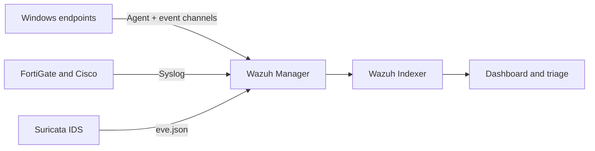

# Enterprise Infrastructure & Security Operations Lab


A segmented enterprise lab that combines resilient networking, Windows domain services, next-generation firewall controls, and centralized security monitoring. The environment was designed, deployed, hardened, and validated on **Proxmox VE** and **EVE-NG**.

> Portfolio scope: defensive security engineering and SOC monitoring in an isolated lab. All public configuration samples are sanitized and contain placeholders instead of credentials or private keys.

## Recruiter quick view

| Area | Implementation |
| --- | --- |
| Infrastructure | Proxmox VE, EVE-NG, virtual switching, isolated lab bridges |
| Network | VLAN segmentation, inter-VLAN routing, OSPF, HSRP, LACP, Rapid-PVST |
| Perimeter security | FortiGate Active-Passive HA, policy enforcement, NAT/VIP, IKEv2 VPN |
| Security controls | SSL inspection, Web/DNS filtering, IPS, antivirus, application control |
| Windows services | AD DS, DNS, DHCP, File Server, OU design, GPO hardening and auditing |
| Detection & monitoring | Wazuh XDR/SIEM, Sysmon, Windows Event Logs, FIM, SCA, Syscollector, Syslog, Suricata |
| SOC workflow | Alert triage, evidence collection, MITRE ATT&CK mapping, validation and documentation |

## Architecture



The design places Internet-facing services in a dedicated DMZ, restricts east-west traffic with explicit firewall policy, and sends infrastructure and endpoint telemetry to the SOC zone.

## Security monitoring pipeline



Endpoint telemetry includes process creation, network connections, PowerShell activity, authentication events, file and Registry changes, security posture, and asset inventory. Network devices contribute traffic, administrative, interface, routing, and security-event logs.

## Network segmentation

| VLAN | Zone | Subnet | Primary purpose |
| ---: | --- | --- | --- |
| 10 | Management | `10.60.10.0/24` | Administrative access and device logging |
| 20 | Server | `10.60.20.0/24` | Domain and infrastructure services |
| 30 | Office | `10.60.30.0/24` | Corporate user endpoints |
| 40 | Voice | `10.60.40.0/24` | Voice services |
| 50 | Guest | `10.60.50.0/24` | Internet-only guest access |
| 60 | IT | `10.60.60.0/24` | Privileged administration |
| 70 | DMZ | `10.60.70.0/24` | Published Nginx service |
| 80 | SOC | `10.60.80.0/24` | SIEM and IDS components |
| 254 | Transit | `10.60.254.0/29` | FortiGate-to-core Layer-3 transit |

## What I implemented

- Built the virtual infrastructure and connected Proxmox virtual machines to the EVE-NG topology through isolated Linux bridges.
- Designed VLANs, IP addressing, routing boundaries, redundancy, and DHCP relay for an enterprise-style network.
- Deployed FortiGate HA and enforced least-privilege access between Management, Server, Office, Guest, IT, DMZ, and SOC zones.
- Published an Nginx service through a FortiGate VIP and applied inbound security inspection and logging.
- Deployed Windows Server 2019 services, domain structure, Group Policy controls, advanced audit policy, and PowerShell logging.
- Onboarded Windows endpoints to Wazuh and enabled Sysmon, FIM, Registry monitoring, SCA, and Syscollector inventory.
- Centralized Cisco and FortiGate logs through Syslog and integrated Suricata JSON telemetry with Wazuh.
- Defined validation tests and a repeatable alert-triage workflow covering context enrichment, evidence collection, containment decisions, and documentation.

## Validation coverage

| Test | Expected result | Evidence to retain |
| --- | --- | --- |
| FortiGate failover | Secondary member assumes the active role and sessions recover | HA status and failover timestamps |
| OSPF/HSRP/LACP | Adjacency, gateway redundancy, and bundled links remain operational | Neighbor, standby, and EtherChannel outputs |
| VLAN isolation | Only explicitly permitted flows cross security zones | Firewall traffic logs and packet captures |
| Guest restriction | Guest clients reach the Internet but not internal zones | Deny logs and connectivity test results |
| DMZ publishing | External request reaches Nginx through VIP and is logged | VIP policy log and Nginx access log |
| Windows monitoring | Wazuh receives authentication, process, PowerShell, and Sysmon events | Agent status and event details |
| FIM/Registry | Authorized test changes generate integrity alerts | Before/after file metadata and alert |
| Network Syslog | Cisco and FortiGate events appear at the SIEM | Listener capture and indexed event |
| Suricata integration | IDS JSON events are parsed and searchable | `eve.json` record and Wazuh event |

Detailed procedures are in [Validation and evidence](docs/validation-and-evidence.md). The repository intentionally does not claim screenshots that have not been published; use the [evidence checklist](evidence/README.md) before adding your own sanitized images.

## Documentation

- [Implementation guide](docs/implementation-guide.md)
- [Security monitoring design](docs/security-monitoring.md)
- [Incident triage playbook](docs/incident-triage-playbook.md)
- [Validation and evidence](docs/validation-and-evidence.md)
- [Troubleshooting notes](docs/troubleshooting.md)
- [Sanitized configuration templates](configs/README.md)

## Repository structure

```text
.
├── configs/                  # Sanitized templates for lab components
│   ├── cisco/
│   ├── fortigate/
│   ├── nginx/
│   ├── sysmon/
│   └── wazuh/
├── docs/                     # Architecture, deployment, monitoring and validation
├── evidence/                 # Checklist and folders for sanitized screenshots
├── scripts/                  # Pre-publication secret and artifact checks
├── .github/workflows/        # Automated content safety check
├── SECURITY.md
└── README.md
```

## Configuration usage

The files in `configs/` are **reference templates**, not production-ready drop-ins. Review interface names, software versions, addressing, routing, certificates, licensing, and organizational policy before applying them. Replace values formatted as `<PLACEHOLDER>` locally and never commit the resulting secrets.

Run the pre-publication check before every push:

```bash
python3 scripts/pre_publish_check.py
```

## Skills demonstrated

`Network segmentation` · `Firewall policy` · `FortiGate HA` · `OSPF` · `HSRP` · `LACP` · `IPsec VPN` · `Active Directory` · `GPO` · `Wazuh SIEM` · `Sysmon` · `Windows Event Logs` · `Syslog` · `Suricata IDS` · `Log analysis` · `Incident triage` · `Technical documentation`

## Author

**Le Van Tuan Anh**  
Aspiring Network Security / SOC Analyst  
GitHub: [TuanhAnh-LV](https://github.com/TuanhAnh-LV)

