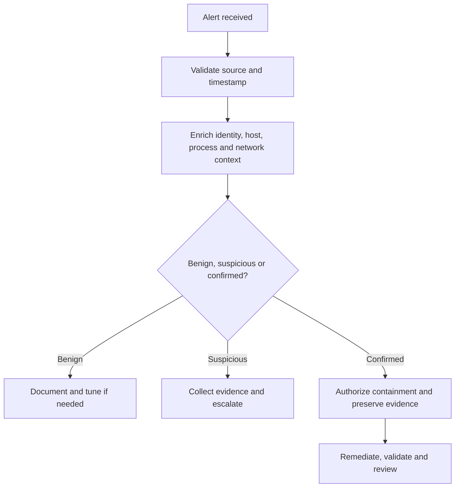

# Incident Triage Playbook

This playbook defines a first-line SOC workflow for alerts generated in the lab. It supports consistent analysis without treating every alert as a confirmed incident.

## Triage flow

## 1. Initial review

Capture the following before changing any system:

- Alert ID, rule, severity, source, destination, and original timestamp.
- Endpoint or device name, address, agent ID, logged-on user, and asset role.
- Relevant process, parent process, command line, hash, file path, domain, IP, and port.
- Related events immediately before and after the alert.
- Whether the behavior matches an approved test or maintenance window.

Confirm that the event is not caused by time drift, duplicated collection, stale inventory, a disconnected agent, or a parsing error.

## 2. Enrichment

| Question | Evidence source |
| --- | --- |
| Who performed the action? | Windows logon events, VPN logs, administrator audit logs |
| What executed? | Security 4688, Sysmon Event 1, PowerShell logs |
| What changed? | FIM, Sysmon file/Registry events, configuration diff |
| Where did it connect? | Sysmon network/DNS, FortiGate, Suricata, DNS logs |
| Is the host exposed or vulnerable? | Syscollector, SCA, vulnerability inventory |
| Is activity broader than one host? | Search by user, hash, IP, domain, process and time range |

## 3. Classification and priority

| Priority | Criteria | Response |
| --- | --- | --- |
| P1 — Critical | Confirmed active compromise or material service impact | Immediate escalation and authorized containment |
| P2 — High | Strong evidence of malicious behavior or privileged-account involvement | Rapid investigation and containment decision |
| P3 — Medium | Suspicious behavior requiring more evidence | Investigate, monitor, and escalate if confirmed |
| P4 — Low | Informational, expected, or low-risk policy deviation | Document, close, or tune |

Priority should combine detection confidence, asset criticality, identity privilege, scope, external exposure, and observed impact.

## 4. Evidence handling

For each artifact, record:

- Collection time in UTC.
- Source system and query/filter used.
- Original path or event identifier.
- Analyst name or case owner.
- File hash for exported artifacts where appropriate.
- Any transformation, redaction, or screenshot annotation.

Keep investigation evidence private. Publish only sanitized examples that contain no personal data, credentials, tokens, private addresses outside the lab plan, or customer information.

## 5. Scenario checklists

### Repeated failed logons

1. Group events by source, user, destination, logon type, and time window.
2. Determine whether a successful logon followed the failures.
3. Review VPN and firewall activity from the same source.
4. Check whether the account is privileged, disabled, expired, or newly created.
5. Compare with approved password testing or administrative activity.
6. Escalate if failures span multiple accounts/hosts or lead to a suspicious success.

### Unexpected PowerShell or process activity

1. Reconstruct the parent-child process chain.
2. Review the full command line and user context.
3. Search for related DNS queries, connections, files, and Registry changes.
4. Compare the hash, path, signer, and execution time with the endpoint baseline.
5. Search other hosts for the same indicators.
6. Escalate if behavior is unexplained, privileged, persistent, or externally connected.

### File or Registry integrity alert

1. Identify the actor, process, original value, new value, and timestamp.
2. Verify whether the path is part of an approved deployment or update.
3. Check process and authentication events around the change.
4. Determine persistence or execution impact.
5. Preserve the original metadata and related event records.

### Firewall or network configuration change

1. Identify the administrator, source address, device, and command/change record.
2. Compare with the approved change request and maintenance window.
3. Check for interface, routing, HA, spanning-tree, or policy impact.
4. Confirm logging remained available throughout the change.
5. Escalate any unauthorized change or unexplained telemetry loss.

## 6. Closure requirements

A case can be closed when:

- Classification and rationale are documented.
- Affected assets, identities, and time range are known.
- Supporting evidence is attached or referenced.
- Required containment/remediation has been completed and verified.
- Detection tuning or control improvements have an owner.
- The case records whether it was a true positive, benign positive, or false positive.

