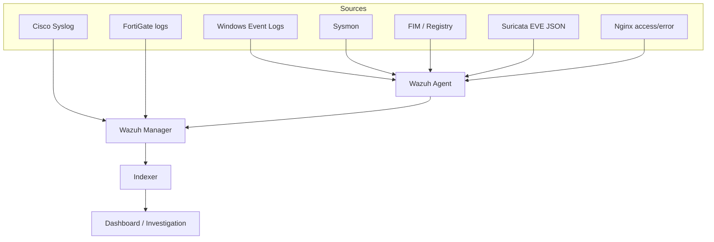

# Security Monitoring Design

## Objective

The monitoring design gives an analyst enough context to answer four questions:

1. What happened?
2. Which identity, endpoint, process, device, and network flow were involved?
3. Is the event expected, suspicious, or confirmed malicious?
4. What evidence and containment action are required next?

## Collection architecture

## Data-source coverage

| Source | Key telemetry | Primary use |
| --- | --- | --- |
| Windows Security | Logon, credential validation, account/group change, process creation | Identity and endpoint investigation |
| PowerShell Operational | Script-block activity | Administrative and script execution visibility |
| Sysmon | Process, parent, hash, network, DNS, file and Registry activity | Process-tree and behavior analysis |
| Wazuh FIM | File and Registry changes, actor where supported | Integrity and persistence monitoring |
| Wazuh SCA | Security configuration checks | Baseline and hardening gaps |
| Syscollector | OS, software, hotfixes, services, ports, processes | Asset enrichment and exposure review |
| Cisco Syslog | Interface, spanning tree, routing, authentication and configuration events | Network availability and administrative audit |
| FortiGate | Allowed/denied traffic, VPN, security profiles, anomaly and CLI audit | Perimeter and policy analysis |
| Suricata | Flow, alert, DNS, HTTP and TLS metadata | Network detection and enrichment |
| Nginx | Client, request, status, user agent and error details | DMZ service monitoring |

## Important Windows and Sysmon events

The exact event set should be tuned to the lab version and use case.

| Provider | Event ID | Analyst value |
| --- | ---: | --- |
| Windows Security | 4624 / 4625 | Successful and failed logons |
| Windows Security | 4648 | Logon using explicit credentials |
| Windows Security | 4688 | Process creation with command line |
| Windows Security | 4720 / 4726 | User creation and deletion |
| Windows Security | 4728 / 4732 | Membership added to privileged/local groups |
| Windows Security | 4719 | Audit policy changed |
| Sysmon | 1 | Process, parent, command line, user and hash |
| Sysmon | 3 | Process-to-IP/port network connection |
| Sysmon | 11 | File creation |
| Sysmon | 12 / 13 / 14 | Registry object and value changes |
| Sysmon | 22 | DNS query associated with a process |

## Endpoint collection policy

The Wazuh group template collects Sysmon and PowerShell event channels, monitors `C:\SOC-Lab`, watches common Registry auto-start locations, inventories the host, and runs SCA checks. Windows Application, Security, and System channels are already collected by the default Windows agent configuration in common deployments; confirm the local version before adding duplicate entries.

Relevant files:

- [Wazuh Windows group template](../configs/wazuh/windows-agent.conf)
- [Sysmon lab policy](../configs/sysmon/sysmon-lab.xml)
- [Suricata integration](../configs/wazuh/suricata-integration.xml)

## Detection engineering workflow

1. Define a behavior and required data source.
2. Generate an authorized, harmless test event.
3. Confirm the raw event reaches the collector.
4. Confirm decoding, fields, timestamps, and host identity.
5. Create or tune the rule with the narrowest reliable logic.
6. Add severity, MITRE ATT&CK context, and investigation notes.
7. Test expected positives and expected negatives.
8. Record false-positive conditions and an owner for future review.

## Baseline first

Collect normal activity before raising alert severity. Useful baselines include:

- Typical administrative source hosts and logon hours.
- Normal parent-child process relationships for managed applications.
- Standard DNS resolvers and common destinations.
- Expected listening ports, services, and installed software.
- Approved firewall administrators and planned configuration windows.
- Normal Nginx status-code distribution and client sources.

## Correlation examples

### Suspicious PowerShell activity

Correlate PowerShell Operational logs with Security 4688, Sysmon Event 1, Sysmon Event 3/22, file changes, and the initiating user. A single script-block event is context; a process tree plus unusual destination, file write, and identity anomaly is stronger evidence.

### Authentication anomaly

Group repeated 4625 events by source, destination, account, logon type, and time window. Check for a later 4624, privileged-group change, VPN authentication, and firewall traffic from the same source. Exclude known scanners and approved testing only after documenting them.

### DMZ web event

Join the Nginx request with FortiGate VIP traffic, IPS/Web Application-related events if available, and Suricata HTTP/TLS metadata. Confirm that the server did not initiate an unexpected internal connection afterward.

### Network configuration change

Correlate Cisco or FortiGate administrative audit logs with the approved change window, administrator source address, configuration-difference record, interface/routing events, and any related loss of telemetry.

## Tuning principles

- Prefer precise fields and allow lists over broad text matching.
- Suppress only understood, documented benign patterns.
- Do not disable a noisy source before checking whether collection scope can be reduced.
- Preserve raw evidence and timestamps during investigation.
- Separate detection severity from business impact; both influence priority.
- Retest rules after agent, operating-system, Wazuh, and network-device upgrades.

## Health monitoring

Monitor the monitoring system itself:

- Agent last-seen time and enrollment status.
- Syslog packet arrival and source-address changes.
- Wazuh Manager, Indexer, and Dashboard service state.
- Queue, disk, and index growth.
- Time drift across all sources.
- Suricata EVE file freshness.
- Sudden drops or spikes in event volume.

